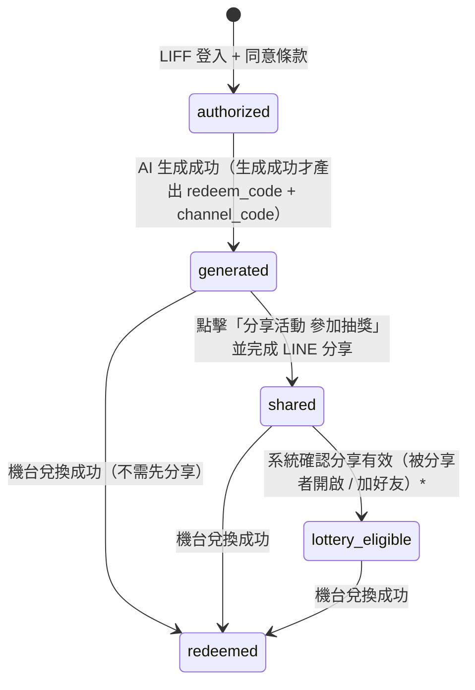
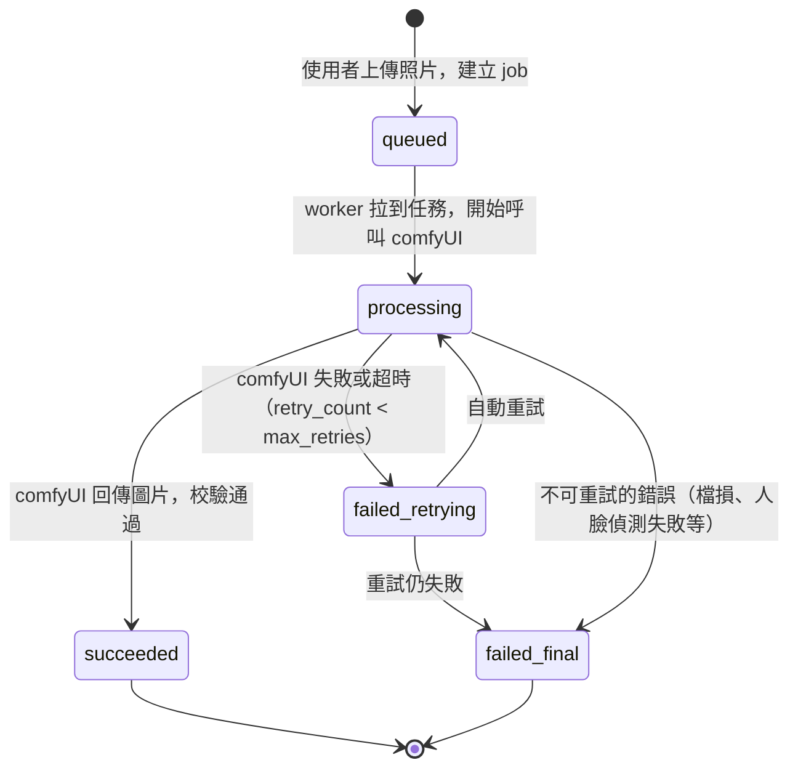
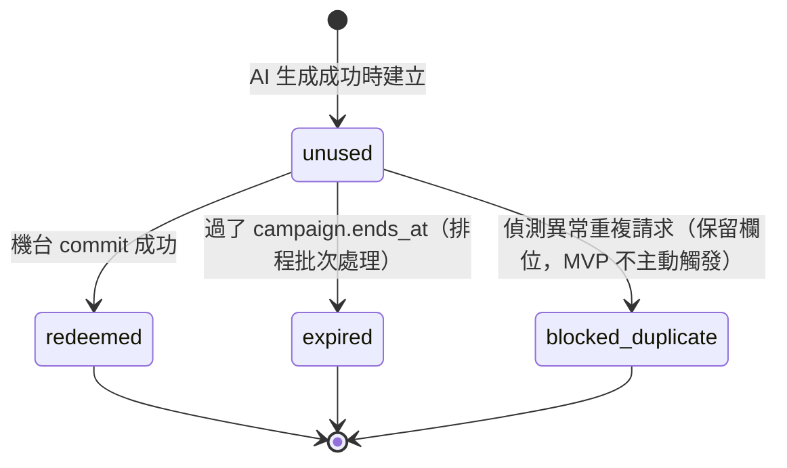

# 狀態機設計

每張表的合法狀態流轉。**任何 API 變更狀態前都必須先驗證來源狀態合法**，不合法直接 409 Conflict。

---

## 1. user_campaigns.status — 使用者活動狀態



\* 抽獎資格條件 PRD 與 UI 不一致，待確認（見最末「待澄清」）。MVP 先用「分享動作完成」即標 `lottery_eligible`，未來若收緊規則只需改判定邏輯。

**重要不變式（invariant）**：
- `redeemed` 不是流程終點，仍可繼續抽獎與接收推播。
- 同一 user 在同一 campaign 只會有一筆 `user_campaigns` 紀錄（DB 已用 UNIQUE 約束）。
- `shared = TRUE` 與 `lottery_eligible = TRUE` 是布林旗標，與 `status` 並存使用 — `status` 只記錄「最近一次主要事件」，旗標是累積狀態。

---

## 2. generation_jobs.status — AI 任務狀態



**轉換規則**：
| 來源 → 目標 | 觸發者 | 額外條件 |
|---|---|---|
| `queued → processing` | worker | `started_at = now()` |
| `processing → succeeded` | worker | `output_image_path` 必須有值；同步觸發「建立 redeem_code」 |
| `processing → failed_retrying` | worker | `retry_count < max_retries` 且錯誤 code 屬於可重試集合 |
| `failed_retrying → processing` | worker | `retry_count += 1` |
| `failed_retrying → failed_final` | worker | `retry_count >= max_retries` |
| `* → failed_final` | worker | 任何不可重試錯誤；UI 顯示「人潮較多請稍後再試」並提供「重試」按鈕（但實際是建立**新的 job**，不會復活舊 job） |

**可重試錯誤集合**（建議）：
- `comfyui_timeout`
- `comfyui_5xx`
- `network_error`
- `queue_overflow`

**不可重試錯誤集合**：
- `invalid_image`（檔損、格式錯誤）
- `no_face_detected`
- `nsfw_detected`
- `image_too_large`

---

## 3. redeem_codes.status — 機台兌換碼狀態



**機台扣碼的併發保護（必讀）**：

```sql
-- 整個流程必須包在一個 transaction 內
BEGIN;

SELECT * FROM redeem_codes
WHERE code = $1
FOR UPDATE;                 -- ★ 加 row lock

-- 在程式碼判斷：
-- 1. 是否存在 → not found
-- 2. status == 'unused' → 否則 already_redeemed / expired
-- 3. expires_at > now() → 否則 expired
-- 4. user_campaigns.campaign_id 是否為當前活動期 → 否則 wrong_campaign

UPDATE redeem_codes
SET status = 'redeemed',
    redeemed_at = now(),
    redeemed_machine_id = $2
WHERE id = $3;

INSERT INTO machine_redemption_attempts (...) VALUES (...);

COMMIT;
```

`SELECT ... FOR UPDATE` + transaction 確保兩個機台同時掃同一張碼，只有一個會成功，另一個會看到已被 lock，等待釋放後讀到 `redeemed` → 回 `already_redeemed`。

---

## 4. channel_codes（通路折扣碼）— 不是狀態機，是「池子」

`channel_codes` 沒有狀態流轉，用 `user_campaign_id IS NULL` 表示未發放、`IS NOT NULL` 表示已發放。

**發放流程（atomic）**：
```sql
BEGIN;

-- 跳過已被別人 lock 的列，挑一張未發的碼
SELECT id, code FROM channel_codes
WHERE campaign_id = $1
  AND user_campaign_id IS NULL
ORDER BY created_at
LIMIT 1
FOR UPDATE SKIP LOCKED;     -- ★ 高併發友善

-- 若取不到 → 回 OUT_OF_STOCK
UPDATE channel_codes
SET user_campaign_id = $2,
    assigned_at = now()
WHERE id = $3;

COMMIT;
```

`FOR UPDATE SKIP LOCKED` 的好處：兩個 user 同時觸發發碼時，不會搶同一張，DB 自動分配不同的給他們，無 retry 需要。

**池耗盡告警**：當 `unassigned count < threshold`（例如 50）時觸發監控告警，提醒匯入更多碼。

---

## 5. 跨表的事件聯動（必須用 transaction）

某些動作會「同時」改多張表的狀態，這些必須在同一 transaction 內：

| 觸發事件 | 影響的表 | 注意事項 |
|---|---|---|
| AI 生成成功 | `generation_jobs.status = succeeded`、`user_campaigns.status = generated`、`redeem_codes` INSERT、`channel_codes.user_campaign_id` UPDATE | 任一失敗整個 rollback |
| 機台扣碼成功 | `redeem_codes.status = redeemed`、`machine_redemption_attempts` INSERT、`user_campaigns.status` 升級為 `redeemed` | row lock 必須用 redeem_codes 的 |
| 分享完成 | `shares` INSERT、`user_campaigns.shared = TRUE`、`status = shared` | 重複分享只 INSERT shares，user_campaigns 旗標保持 TRUE |
| 抽獎中獎 | `lottery_winners` INSERT、`user_campaigns.lottery_result = win`、`push_logs` INSERT | push 失敗不影響中獎結果，只重發 |

---

## 待澄清（影響狀態機判定）

1. **抽獎資格條件**：分享一次就有？還是被分享者也要實際加 OA + 進活動？（PRD vs UI 不一致）
2. **抽獎獎品**：折扣碼（UI page 13）vs LINE Points（UI page 12）— 是同一個「獎」的不同顯示，還是兩種獎品池？
3. **重生機會**：PRD 說 `failed_final` 後「保留一次重生機會」，這個重生算同一個 job 還是新 job？我目前設計成「建立新 job」，舊 job 保持 failed_final 不再變動。
4. **過期清理時機**：`unused` 過了 `expires_at` 是排程主動轉 `expired`，還是 lazy 在被 query 時才認列？（建議排程，這樣機台收到「已過期」訊息較準確）
